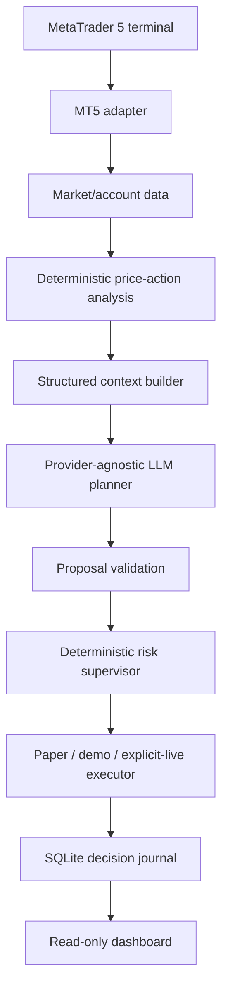

# llm-mt5-agent

[🇮🇷 فارسی: README فارسی](README.fa.md)

**LLM-powered MetaTrader 5 decision-support agent — demo-first, explainable, testable, and safety-bounded.**

`llm-mt5-agent` reads MT5 market and account state, runs deterministic price-action analysis, asks a configurable LLM for a structured proposal, validates the proposal against deterministic risk rules, and records the result. It is a trading assistant, not an autonomous black-box trader. LLM output can never bypass the risk or execution gates.

## Overview



The default path is **DRY_RUN**: no MT5 order calls occur. `DEMO` must use a connected account that reports a demo/contest trade mode. `LIVE` is disabled unless explicitly enabled and still requires a verified MT5 connection.

## Key features

- MT5 connectivity, account, terminal, position, order, history, symbol, tick, and OHLCV adapters.
- Deterministic Donchian/structure-break analysis separated from LLM reasoning.
- Strict `BUY`/`SELL`/`HOLD` proposal schema with safe `HOLD` fallback.
- Direction binding: a directional LLM action must match the deterministic signal.
- Fail-closed daily-loss, spread, stop-distance, and account-safety checks.
- Account-wide position and exposure checks before execution.
- Duplicate-signal protection, cooldown, margin, session, SL/TP, and configured exposure limits.
- Paper/dry-run and demo execution modes; live mode disabled by default.
- Provider abstraction for OpenAI-compatible, Ollama, and Gemini-compatible integrations.
- SQLite-backed short-term, trade, strategy, and world memory.
- Read-only local dashboard with escaped values and security headers.
- Structured logging and audit events with secret/account redaction.
- Unit, fake-integration, live-gated MT5, and Windows-friendly quality checks.

## Quick start on Windows

Requirements: Git, Python 3.12+, the MetaTrader 5 terminal, and an already logged-in Demo account for MT5 integration.

```powershell
cd D:\Projects\llm-mt5-agent
python -m venv .venv
.\.venv\Scripts\Activate.ps1
python -m pip install -e ".[dev,mt5]"
Copy-Item .env.example .env
python -m mt5_agent --version
python scripts/smoke.py
pytest -m "not integration" -q
```

The repository was validated on Windows with Python 3.12.9 and the supplied terminal:

```text
C:\Program Files\Alpari MT5_2\terminal64.exe
C:\Users\BazikadeStore\AppData\Roaming\MetaQuotes\Terminal\AF19ECCF568F855DF9D3196BBF8BF315
```

The read-only probe connected to the Alpari Demo terminal and retrieved `EURUSD M1` candles and tick data. Algo Trading was disabled in that terminal at verification time, so demo execution was not attempted.

## Configuration

Configuration precedence is:

1. explicit constructor values;
2. `MT5_AGENT_*` environment variables;
3. `config/app.yaml`;
4. safe built-in defaults.

Secrets are never stored in YAML. Copy `.env.example` to `.env`; `.env` is ignored by Git. Keep `MT5_AGENT_TRADING_MODE` and `MT5_AGENT_EXECUTION_MODE` identical; `execution_mode` is authoritative and defaults to `dry_run`.

Important settings:

| Setting | Purpose | Default |
|---|---|---|
| `MT5_AGENT_MT5_PATH` | MT5 terminal executable | terminal discovery |
| `MT5_AGENT_MT5_LOGIN` | Demo account login | unset |
| `MT5_AGENT_MT5_PASSWORD` | Demo account password | unset |
| `MT5_AGENT_MT5_SERVER` | Demo server | terminal session |
| `MT5_AGENT_LLM_PROVIDER` | `none`, `openai`, `ollama`, etc. | `none` |
| `MT5_AGENT_LLM_MODEL` | Provider model | unset |
| `MT5_AGENT_LLM_BASE_URL` | OpenAI-compatible endpoint | unset |
| `MT5_AGENT_RISK_MAX_RISK_PCT` | Maximum proposed risk percentage | `1.0` |
| `MT5_AGENT_RISK_MAX_DAILY_LOSS_PCT` | Daily loss limit | `3.0` |
| `MT5_AGENT_RISK_MAX_POSITIONS` | Account-wide open-position limit | `3` |
| `MT5_AGENT_RISK_MAX_EXPOSURE` | Gross volume limit | `1.0` |
| `MT5_AGENT_EXECUTION_MODE` | `dry_run`, `demo`, or `live` | `dry_run` |
| `MT5_AGENT_MEMORY_DB_PATH` | Local journal path | `data/memory.db` |

See [`.env.example`](.env.example), [`config/app.yaml`](config/app.yaml), and [configuration documentation](docs/configuration.md).

## Running the project

All commands below are real commands in this repository.

```powershell
# Read-only MT5 terminal/account probe
$env:MT5_AGENT_MT5_PATH = 'C:\Program Files\Alpari MT5_2\terminal64.exe'
python scripts/check_mt5.py

# Read-only market snapshot (default EURUSD M1)
python scripts/check_market.py

# Deterministic strategy analysis using live MT5 data
python scripts/check_strategy.py

# Offline planner contract smoke test with the LLM stub; MT5 is still required
python scripts/check_plan.py --stub

# One agent cycle; default is dry-run and does not submit orders
python scripts/run_agent.py --symbols EURUSD --timeframe M1 --cycles 1

# Continuous dry-run loop
python scripts/run_agent.py --symbols EURUSD --timeframe M1 --loop

# Read-only dashboard
python scripts/serve_dashboard.py
```

`check_execute.py` is for explicit dry-run/demo execution checks. Read its help and use dry-run unless a demo test is intentionally being performed.

## Decision model

A valid directional proposal is structurally similar to:

```json
{
  "action": "BUY",
  "confidence": 0.78,
  "entry": 1.1375,
  "stop_loss": 1.1371,
  "take_profit": 1.1383,
  "risk_pct": 0.5,
  "volume": 0.01,
  "rationale": "structure break with follow-through"
}
```

The planner can choose only `BUY`, `SELL`, or `HOLD`. `BUY` requires a deterministic `LONG` signal; `SELL` requires a deterministic `SHORT` signal. Ambiguous or unavailable context results in `HOLD` or a rejected proposal, never an invented order.

Risk validation is independent of the LLM. It checks account safety, sessions, symbols, daily loss, positions, exposure, spread, SL/TP, stop distance, duplicates, and cooldowns. Unknown safety-critical inputs fail closed for directional proposals.

## Dashboard

The dashboard is a read-only, loopback-by-default HTTP service. It shows account, market, strategy, risk, memory, and LLM status. It has no order buttons or trading endpoints. Keep it on `127.0.0.1`; if exposed beyond localhost, place it behind an authenticated reverse proxy and TLS.

## Testing

```powershell
pytest -m "not integration" -q
ruff check src tests scripts
ruff format --check src tests scripts
mypy src
python scripts/smoke.py
```

MT5 integration tests are explicitly gated:

```powershell
$env:MT5_AGENT_RUN_LIVE_MT5_TESTS = 'true'
pytest tests/integration -q
```

The integration suite is read-only unless a test explicitly uses an approved Demo execution path. Never use real-money accounts for development or validation.

## Documentation

- [Architecture](docs/architecture.md)
- [Installation](docs/installation.md)
- [Configuration](docs/configuration.md)
- [MT5 setup](docs/mt5-setup.md)
- [LLM integration](docs/llm.md)
- [Signals and analysis](docs/signals.md)
- [Risk management](docs/risk-management.md)
- [Testing](docs/testing.md)
- [Troubleshooting](docs/troubleshooting.md)
- [Development](docs/development.md)
- [FAQ](docs/faq.md)
- [Persian README](README.fa.md)

## Project structure

```text
src/mt5_agent/
  domain/          pure models and ports
  application/     orchestration, risk context, agent lifecycle
  infrastructure/  MT5 adapters and provider transports
  strategies/      deterministic analysis
  ai/              LLM provider and validated planner
  risk/            deterministic rules and supervisor
  execution/       dry-run/demo/live-gated executor
  memory/          SQLite journal and scoped memory
  dashboard/       read-only dashboard
scripts/           operational probes and entry points
tests/             unit, fake integration, and gated MT5 tests
```

## Security and privacy

- Never commit `.env`, passwords, API keys, tokens, private keys, or account data.
- Use environment variables or a local secret manager.
- LLM providers may receive market candles and account context; review provider retention, training, and regional policies before using a hosted model.
- The SQLite journal is local and not encrypted by default. Protect the file with operating-system permissions and backups.
- A non-loopback dashboard is not authenticated. Keep it local or proxy it securely.
- LLM output is data, not an instruction to execute arbitrary commands.

## Roadmap

Completed foundation: MT5 adapters, market/account/history data, deterministic strategy, LLM provider abstraction, validated planner, deterministic risk, execution gates, memory, agent, dashboard, and hardening. Current work focuses on safety correctness, durable execution reconciliation, freshness/reconnect integration, broader evaluation, and operational documentation.

## Disclaimer

This project is educational decision-support software. It does not provide financial advice, guarantee accuracy, guarantee profitability, or replace responsible risk management. Trading leveraged instruments can lose more than the initial deposit. Start with read-only and paper/dry-run testing, then use a Demo account only when you understand the broker and terminal configuration.

## License

MIT. See [LICENSE](LICENSE).
