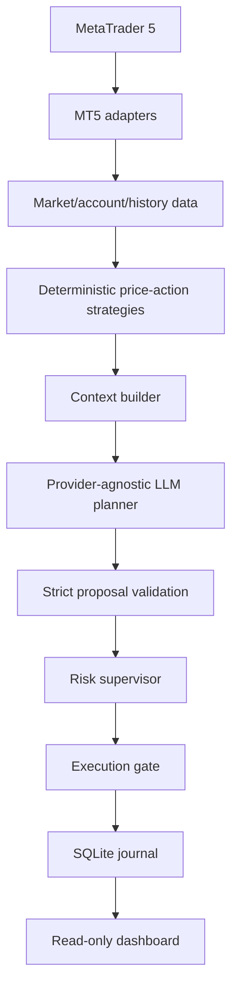

# Architecture

The system is a layered decision-support pipeline. Pure domain models and ports do not import MT5, the LLM, SQLite, or HTTP code.

## Safety boundary

The LLM can propose `BUY`, `SELL`, or `HOLD`. It cannot change risk configuration, select execution mode, or submit a command. Directional proposals must match the deterministic strategy signal. The supervisor independently validates account, market, session, exposure, bracket, duplicate, and cooldown data.

`DRY_RUN` is the default. `DEMO` requires a connected account and rejects real account trade mode. `LIVE` requires explicit opt-in and remains unsuitable for unattended operation until durable order reconciliation is added.

## Data boundaries

MT5 raw objects are mapped into frozen domain models. Strategies consume only market models. The planner receives a compact JSON context, not arbitrary terminal objects. LLM output is parsed and validated before it reaches the supervisor. Local memory stores structured summaries and decisions, not credentials.

## Main modules

- `domain/`: models, enums, and ports.
- `application/`: connection, market, account, strategy, agent, and health workflows.
- `infrastructure/mt5/`: MetaTrader5-backed adapters.
- `strategies/`: deterministic price-action and structure analysis.
- `ai/`: provider abstraction, prompt construction, and planner validation.
- `risk/`: pure risk rules and supervisor.
- `execution/`: execution modes and MT5 order adapter.
- `memory/`: SQLite store and scoped memory records.
- `dashboard/`: loopback read-only HTTP view.

## Failure model

Observation failures stop a cycle. LLM failures become `HOLD`. Unknown safety-critical risk data rejects directional execution. Execution timeouts become `UNKNOWN`; an operator must reconcile positions and deals before any retry. The agent never closes positions during shutdown.
